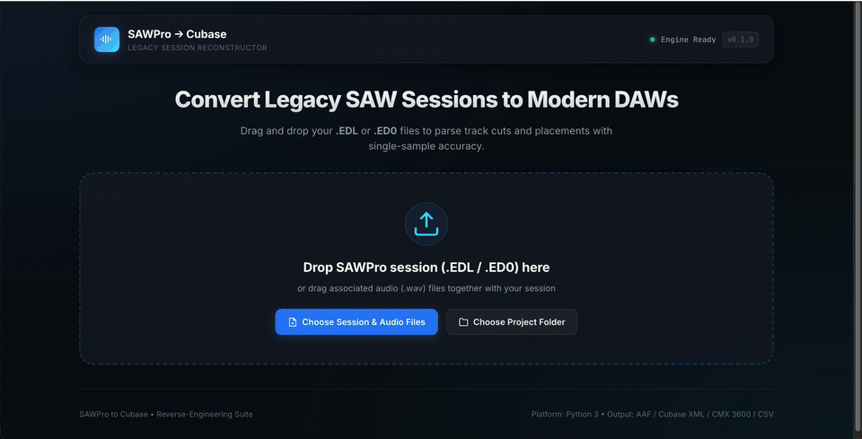

# SAWPro to Cubase (`sawpro_to_cubase`)

<p align="center">
  
</p>

A Python utility and library for reverse-engineering legacy **IQS SAWPro / SAWPLUS32 / SAW32** binary session files (`.EDL` and `.ED0`) and exporting multi-track timelines to modern Digital Audio Workstations (specifically **Steinberg Cubase**, as well as Pro Tools, Logic Pro, and DaVinci Resolve).

---


## AI Assistance Disclosure
Parts of the codebase, boilerplate, or documentation in this repository were written with the assistance of Large Language Models (LLMs) like Claude and Gemini. All logic and generated code have been reviewed, tested, and validated by the maintainer.


## Features

- **Sample-Accurate Reverse Engineering**: Extracts timeline event timings, clip placements, and source in/out cuts directly from binary session tables to the exact single sample.
- **Cross-Platform Audio Path Resolution**: Resolves legacy DOS/Windows drive paths (e.g. `F:\Kunst\Lyd\vals1\Git1.wav`) against local project folders using case-insensitive filename matching.
- **Multiple Interchange Formats (Exported by Default)**:
  - **AAF (Advanced Authoring Format)**: Universal open industry standard (`.aaf`) importable by Cubase Pro, Pro Tools, Logic Pro, DaVinci Resolve, etc. Includes a dedicated Timecode slot and links referenced audio files by default using portable relative RFC URIs for seamless Cubase import.
  - **Steinberg Track Archive XML**: Native Cubase/Nuendo XML (`.xml`) importable via *File > Import > Track Archive*.
  - **CMX 3600 EDL**: Industry-standard edit decision list (`.edl`).
  - **Scriptable CSV**: Clean spreadsheet of tracks, sample offsets, seconds, SMPTE timecodes, and source file metadata.
- **Linked or Embedded Audio Options**: AAF exports link to source audio files by default (optimal for Cubase), with an optional `--embed-audio` flag if embedded raw PCM audio essence is needed.
- **Portable Relative Paths**: Generates relative paths by default for AAF, XML, CSV, and CMX (relative to the export destination directory), allowing sessions to be moved across drives or operating systems without breaking media links.
- **Zero Heavy Dependencies**: Pure Python standard library with lightweight `pyaaf2` for AAF container serialization.

---

## Installation

```bash
# Clone or navigate to the repository
cd sawpro_to_cubase

# Create and activate a virtual environment
python3 -m venv .venv
source .venv/bin/activate  # On Windows: .venv\Scripts\activate

# Install package in editable mode
pip install -e .
```

---

## Interactive Web Application & Audio Player

Launch the local web application from the command line:

```bash
# Launch directly using the dedicated entrypoint
sawpro-web

# Or via the main CLI
sawpro-to-cubase --web
```

### Web Features
- **Drag-and-Drop Workflow**: Drag a session folder or drop `.edl`, `.ed0`, and `.wav` files directly into the browser.
- **In-Browser Multitrack Audio Player**:
  - Sample-accurate preview of the session using the native Web Audio API (`AudioContext`).
  - **Full Transport Controls**: Play, Pause, Stop, Spacebar keyboard shortcut, master volume, and master mute.
  - **Synchronized Moving Playhead**: An animated scrubber line sweeps across track lanes in sync with audio.
  - **Click-to-Seek**: Click anywhere on the ruler, lanes, or clips to scrub immediately to that point in time.
  - **Track Solo & Mute**: Toggle individual track `M` (Mute) and `S` (Solo) buttons directly from the track lane headers (automatically initialized from the EDL session's mute/solo flags).
  - **Client-Side Decoding**: Instant playback without server roundtrips when audio files are dropped into the browser.
- **Mixdown Audio Export**: Download the active multitrack mix directly to **WAV** or **MP3** respecting muted and soloed tracks.
- **One-Click DAW Exports**: Download individual `.aaf`, `_cubase.xml`, `.csv`, `_cmx.edl` files, or download all bundled in an interchange ZIP.

---

## Quickstart & CLI Usage

Once installed, the CLI is available as `sawpro-to-cubase` or via `python -m sawpro_to_cubase`.

### 1. Inspect a Session Without Exporting (`--info`)

Print session metadata, referenced audio files, region cuts, and multi-track placement timings:

```bash
sawpro-to-cubase data/vals1/vel.edl --info
```

Sample output:
```text
============================================================
 SAWPro Session Information: vel.edl
============================================================
 Magic Signature : SAWPLUS32 EDL
 Sample Rate     : 44100 Hz
 SMPTE Code      : 96
 Active Tracks   : 3
 Total Placements: 3
------------------------------------------------------------
Soundfiles (3):
  [0] Git1.wav (RESOLVED)
      Original: F:\Kunst\Lyd\vals1\Git1.wav
      Local   : data/vals1/Git1.wav (1ch, 44100Hz, 108.86s)
  [1] Git2.wav (RESOLVED)
      Original: F:\Kunst\Lyd\vals1\Git2.wav
      Local   : data/vals1/Git2.wav (1ch, 44100Hz, 77.09s)
  [2] Bass.wav (RESOLVED)
      Original: F:\Kunst\Lyd\vals1\Bass.wav
      Local   : data/vals1/Bass.wav (1ch, 44100Hz, 104.30s)
------------------------------------------------------------
Multi-Track Timeline Placements:
  Track 01 | Start: 00:00:00:00 (  0.000s) | Dur: 108.855s | Clip: '[Git1.wav] | #001' (Git1.wav)
  Track 02 | Start: 00:00:21:02 ( 21.066s) | Dur:  77.085s | Clip: '[Git2.wav] | #002' (Git2.wav)
  Track 03 | Start: 00:00:00:18 (  0.586s) | Dur: 104.275s | Clip: '[Bass.wav] | #004' (Bass.wav)
============================================================
```

### 2. Export All Formats

By default, exports AAF, Cubase Track Archive XML, CSV, and CMX 3600 EDL to the destination folder:

```bash
sawpro-to-cubase data/vals1/vel.edl -o exports/ -a data/vals1/
```

Generated files:
- `exports/vel.aaf` (linked AAF with Timecode slot, ready for Cubase Pro)
- `exports/vel_cubase.xml`
- `exports/vel.csv`
- `exports/vel_cmx.edl`

### 3. Command-Line Options

| Option | Description | Default |
| :--- | :--- | :--- |
| `input_file` | Path to `.EDL` or `.ED0` session file | *(Required)* |
| `-o`, `--output-dir` | Directory to save exported files | Current directory |
| `-a`, `--audio-dir` | Directory containing source `.wav` audio files | Same directory as input file |
| `-f`, `--format` | Output format: `all`, `aaf`, `cubase`, `csv`, `cmx` | `all` |
| `--embed-audio` | Embed raw audio essence inside AAF instead of linking external files | `False` (linked by default) |
| `--absolute-paths` | Use absolute audio paths instead of relative paths | `False` (relative by default) |
| `--fps` | SMPTE timecode frame rate | `30.0` |
| `--drop-frame` | Enable drop-frame SMPTE calculation (for 29.97 fps) | `False` |
| `--info` | Display detailed session summary without exporting | `False` |
| `-v`, `--verbose` | Enable debug logging | `False` |

---

## Importing Into Modern DAWs

### Steinberg Cubase / Nuendo

#### Option A: AAF Import (Recommended)
1. Open or create a project in **Cubase Pro** matching the session sample rate (e.g. `44.1 kHz`).
2. Go to **File > Import > AAF...**.
3. Select `exports/<session_name>.aaf`.
4. In the Cubase AAF Import Options dialog, select all tracks and click **OK**. Cubase extracts the audio clips and places them onto the timeline at their exact sample offsets.

#### Option B: Track Archive Import
1. In Cubase, go to **File > Import > Track Archive...**.
2. Select `exports/<session_name>_cubase.xml`.
3. The tracks, clip cuts, and audio pool references are placed directly on the timeline.

### Pro Tools / Logic Pro / DaVinci Resolve
- Use **File > Import > AAF...** to import the generated `.aaf` file.

---

## Python API Usage

The package can also be used as a Python library:

```python
from sawpro_to_cubase import parse_edl, export_aaf, export_cubase_xml, export_csv

# Parse session
session = parse_edl("data/vals1/vel.edl", audio_dir="data/vals1")

print(f"Sample Rate: {session.header.sample_rate} Hz")
print(f"Active Tracks: {session.header.active_tracks}")

# Access resolved timeline events
for ev in session.get_resolved_events():
    print(f"Track {ev.track_number}: {ev.region_name} @ sample {ev.timeline_start_samples}")

# Export formats
export_aaf(session, "exports/vel.aaf", relative_paths=True)
export_cubase_xml(session, "exports/vel_cubase.xml", relative_paths=True)
export_csv(session, "exports/vel.csv", relative_paths=True)
```

---

## Binary File Structure (`.EDL`)

SAWPro EDL files use a little-endian tagged record format:

| Tag | Stride | Description |
| :--- | :--- | :--- |
| `Header` | `16` bytes | Magic signature: `SAWPLUS32 EDL  \0`, `SAW32`, etc. |
| `SRATE` | `4` bytes | Sample rate uint32 (`44100`, `48000`, etc.) |
| `SMPTE` | `4` bytes | SMPTE timecode format mode |
| `FILES` | `336` bytes | Soundfile table: Null-terminated DOS/Windows paths |
| `REGIONS` | `160` bytes | Region table: ASCII name, in-point, out-point, soundfile ID |
| `TRACK01`..`TRACK44` | `48` bytes | Multi-track event list: Region ID, timeline start, timeline end |

---

## Running the Test Suite

Run the automated unit and integration tests using Python's `unittest`:

```bash
.venv/bin/python -m unittest discover -s tests -p "test_*.py" -v
```

---

## License

MIT License. See [pyproject.toml](pyproject.toml).
